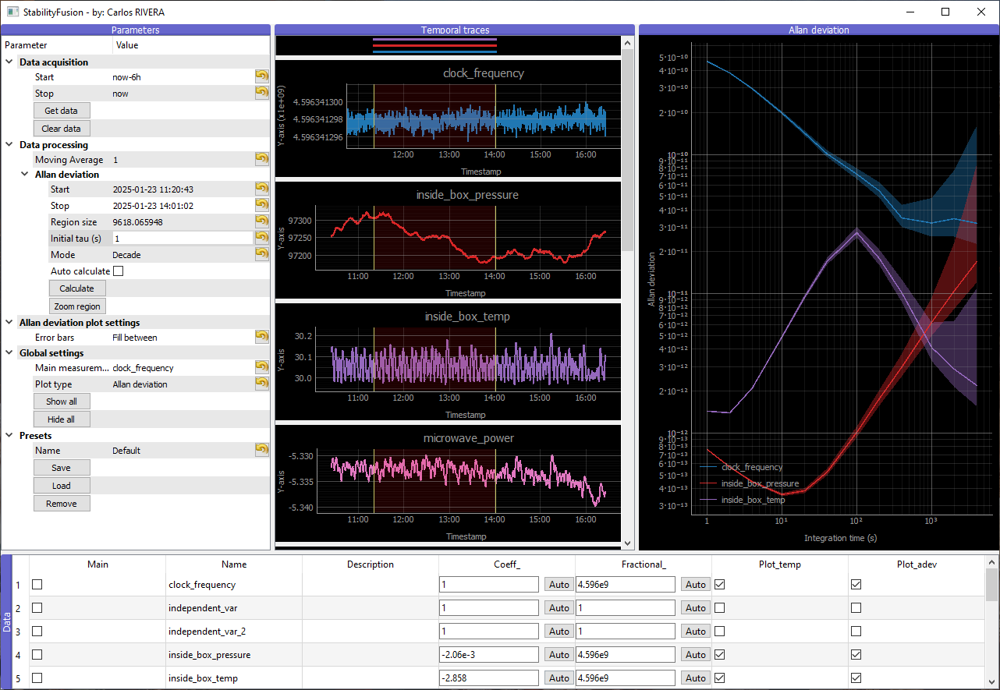
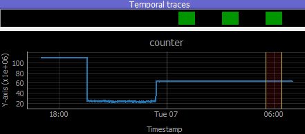
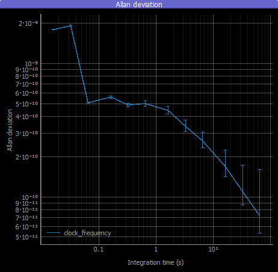
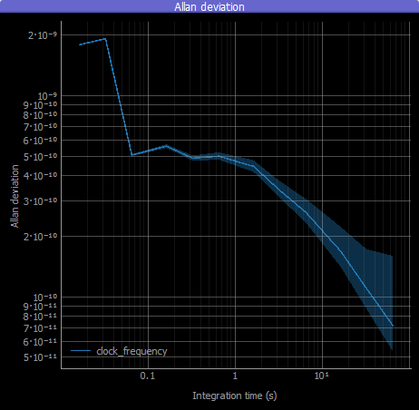

# StabilityFusion

StabilityFusion is a software designed to process, analyze, and visualize scientific and industrial data. This project integrates advanced computational techniques with a user-friendly interface, making it an invaluable tool for researchers and engineers working with stability data.



## Features

### 1. Comprehensive Data Processing
StabilityFusion offers a variety of data processing tools to ensure accurate and meaningful analysis:
- **Allan Deviation Analysis**: Compute stability of time-domain data using the Allan variance method. Error bar calculation is included to visualize uncertainty.

- **Moving Average Calculation**: Smooth out short-term fluctuations in datasets to better visualize patterns that may reveal correlation between measurements.


### 2. InfluxDB Integration
StabilityFusion seamlessly integrates with **InfluxDB**, a time-series database, to:
- Retrieve data directly from configured buckets.
- Simplify data acquisition and storage.
- Enable real-time analysis of incoming data streams.

### 3. Interactive User Interface
StabilityFusion includes an intuitive and interactive interface built using PyQt and PyQtGraph:
- **Parameter Tree**: Organize and configure data acquisition and processing settings in a hierarchical structure.

- **Abosolute and relative date selection**: Specify timestamps using standard ISO format (e.g., `YYYY-MM-DD HH:MM:SS`) for absolute values or natural language expressions (e.g., `now-6h`) for relative timestamps.

- **Temporal Plotting Window**: Visualize the  time-domain data streams being analyzed, and interactively select a region of interest.

- **Allan Deviation Plotting Window**: Analyze the stability of each measurement within the region of interest using Allan deviation plots.

- **Dynamic Plot Management**: Easily show or hide individual plots for a clutter-free view.

- **Bottom Table for Parameter Management**: Adjust sensitivity coefficients and fractional denominators for parameters:
  - Auto-calculate denominators based on the mean of data, to obtain the fractional stability.
  - Auto-calculate the sensitivity coefficients of measurements with respect to a main parameters (typically the local oscillator) to observe the stability contribution.
  - Manually input values for custom analysis.

- **Preset Save and Load**: Effortlessly save and restore workspaces, including the parameter tree and parameter management table configurations.
### 4. Configurable
- Flexible settings in `config/settings.json` to adapt to many projects.

<!-- ```json
// Experiment 1
{
    "influxdb": {
        "url": "http://localhost:8086",
        "token": "token_1",
        "org": "org_1",
        "bucket": "bucket_1"
    }
}

// Experiment 2
{
    "influxdb": {
        "url": "http://your-website:8888",
        "token": "token_2",
        "org": "org_2",
        "bucket": "bucket_2"
    }
}
``` -->

### 5. Scalable Design
StabilityFusion is designed to efficiently manage large datasets by leveraging asynchronous database communication and a smart, cache-based algorithm. This approach minimizes data fetching operations, ensuring smooth performance even when handling extensive time-series data.

Visually keep track of cached data:



### 6. Uncertainty Analysis
The Allan deviation module includes uncertainty analysis:
- Calculate error bars for uncertainty representation.

<div style="display: flex; justify-content: space-between;">
  
  
</div>

- Flexible tau selection (decade, octave or all).

## Installation

1. Clone the repository:
   ```bash
   git clone https://github.com/username/StabilityFusion.git
   ```
2. Navigate to the project directory:
   ```bash
   cd StabilityFusion
   ```
3. Install dependencies using your package manager (e.g., Pixi):
   ```bash
   pixi install
   ```

## Configuration

Create a configuration file (with the structure of `config/settings_example.json`) to configure database settings:
```json
{
    "influxdb": {
        "url": "http://localhost:8086",
        "token": "your_token",
        "org": "your_org",
        "bucket": "your_bucket"
    }
}
```

## Usage

1. Launch the application:
   ```bash
   pixi run python main.py
   ```
2. Use the interface to:
   - Retrieve data from InfluxDB.
   - Analyze data using Allan deviation and moving averages.
   - Customize plot settings and parameter adjustments.

## Example Workflow

1. **Connect to InfluxDB**: Retrieve data from a configured database bucket.
2. **Visualize Time-Series Data**: Plot real-time data in the temporal plotting window.
3. **Perform Stability Analysis**: Compute Allan deviation with error bars.
4. **Fine-Tune Parameters**: Use the bottom table to adjust coefficients and toggle plot visibility.
5. **Save Results**: Export analyzed data and visualizations for further reporting.

## Contributing

I welcome contributions to enhance StabilityFusion! To contribute:
1. Fork the repository.
2. Create a new branch for your feature or bug fix.
3. Submit a pull request for review.

## License

StabilityFusion is distributed under the GNU General Public License version 2 (GPLv2). For more details, please refer to the [LICENSE](LICENSE) file.

<!-- ## Acknowledgments

We thank all contributors and the open-source community for their support in developing this project. -->

